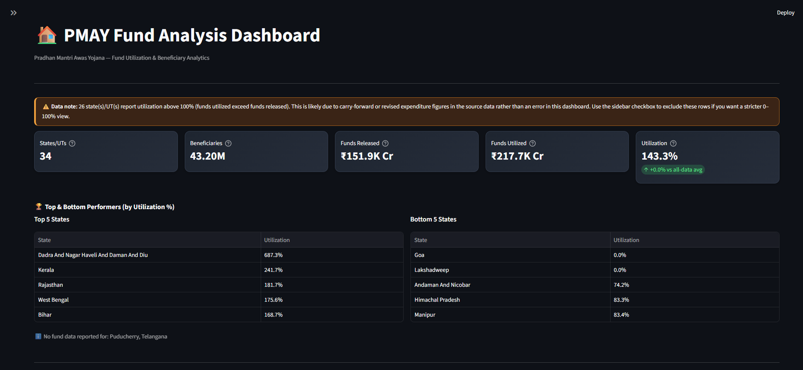
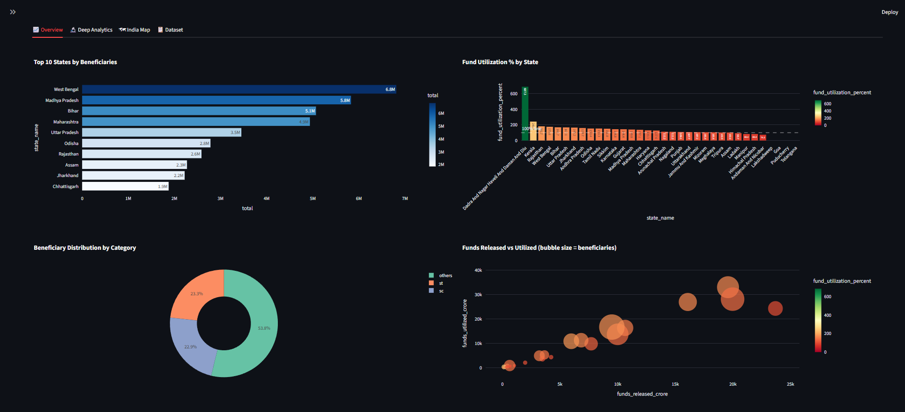
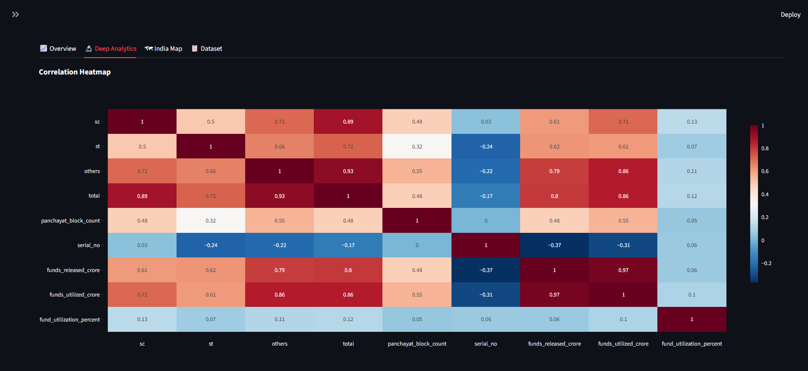
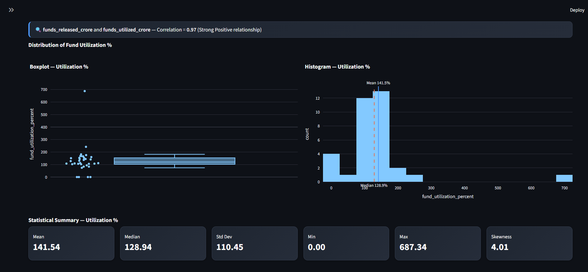
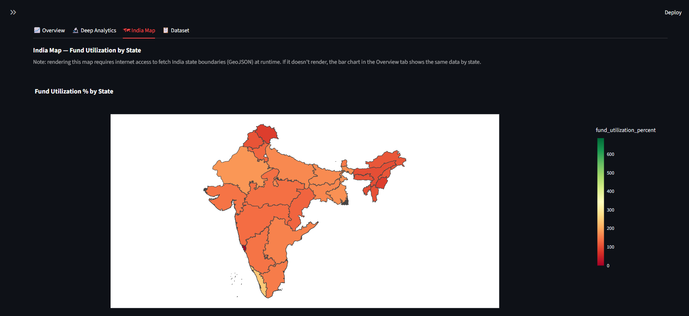
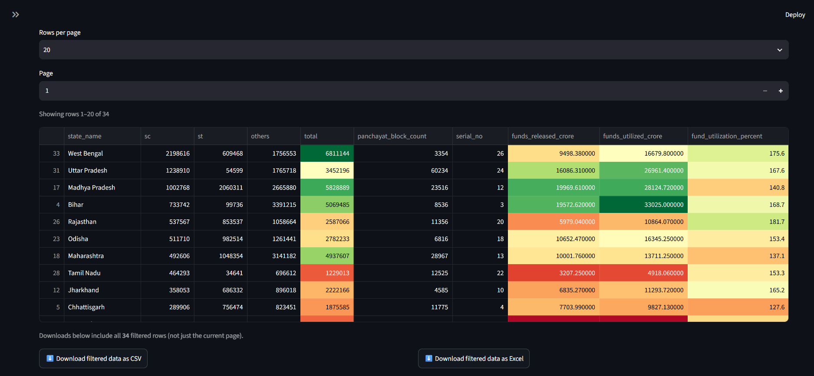

# 🏠 PMAY Fund Analysis Dashboard

An interactive **Data Analytics Dashboard** built using **Python, Pandas, Plotly, and Streamlit** to analyze the **Pradhan Mantri Awas Yojana (PMAY)** fund distribution, utilization, and beneficiary statistics across Indian States and Union Territories.

This project demonstrates a complete Data Analytics workflow including **data cleaning, exploratory data analysis (EDA), feature engineering, interactive visualization, statistical analysis, and dashboard development**.

---

# 📸 Dashboard Preview

## 🏠 Home Dashboard



---

## 📊 Overview Dashboard



---

## 📈 Deep Analytics





---

## 🗺 India Fund Utilization Map



---

## 📋 Dataset Explorer



---

# 🚀 Features

✅ Interactive KPI Cards

- States / UTs
- Total Beneficiaries
- Funds Released
- Funds Utilized
- Fund Utilization %

---

✅ Smart Filters

- State Selection
- Utilization %
- Beneficiaries
- Funds Released
- Funds Utilized

---

✅ Interactive Charts

- Bar Charts
- Bubble Charts
- Pie / Donut Charts
- Correlation Heatmap
- Histogram
- Boxplot
- Scatter Plot

---

✅ Deep Analytics

- Correlation Analysis
- Statistical Summary
- Distribution Analysis
- Outlier Detection
- Auto-generated Insights

---

✅ India Map Visualization

State-wise Fund Utilization Choropleth Map.

---

✅ Dataset Explorer

- Search
- Sort
- Pagination
- Export to CSV
- Export to Excel

---

# 📊 Key KPIs

- Total States / UTs
- Total Beneficiaries
- Funds Released (Crore)
- Funds Utilized (Crore)
- Utilization Percentage

---

# 📈 Dashboard Insights

The dashboard automatically identifies:

- Highest Beneficiary State
- Lowest Beneficiary State
- Highest Fund Utilization
- Lowest Fund Utilization
- Average Utilization
- Median Utilization
- Correlation between Funds Released & Utilized
- Statistical Summary

---

# 🛠 Tech Stack

### Programming

- Python

### Libraries

- Pandas
- NumPy
- Plotly
- Streamlit

### Data Analysis

- Exploratory Data Analysis (EDA)
- Feature Engineering
- Statistical Analysis

### Tools

- VS Code
- Git
- GitHub

---

# 📂 Project Structure

```
PMAY Fund Analysis
│
├── dashboard/
│   └── app.py
│
├── data/
│   ├── raw/
│   └── cleaned/
│
├── images/
│
├── reports/
│
├── sql/
│
├── src/
│
├── requirements.txt
│
└── README.md
```

---

# ⚙ Installation

Clone the repository

```bash
git clone https://github.com/Bhavya2k23/PMAY-Fund-Analysis-Dashboard.git
```

Go inside project

```bash
cd PMAY-Fund-Analysis-Dashboard
```

Install dependencies

```bash
pip install -r requirements.txt
```

Run the dashboard

```bash
streamlit run dashboard/app.py
```

---

# 📊 Dataset

Source:

PMAY-G Open Government Dataset

The data was cleaned, transformed, merged, and analyzed using Python.

---

# 💡 Skills Demonstrated

- Data Cleaning
- Data Wrangling
- Exploratory Data Analysis
- Feature Engineering
- Dashboard Development
- Statistical Analysis
- Data Visualization
- Interactive Filtering
- Python Programming
- Git & GitHub

---

# 🔮 Future Improvements

- Machine Learning Predictions
- District-level Analysis
- Time-Series Trends
- PDF Report Export
- User Authentication
- Live Government Data Integration

---

# 👨‍💻 Author

**Bhavya**

Data Analyst | Python | SQL | Power BI | Excel | Streamlit | Plotly

GitHub:
https://github.com/Bhavya2k23

---

# ⭐ If you found this project useful, don't forget to Star the repository.